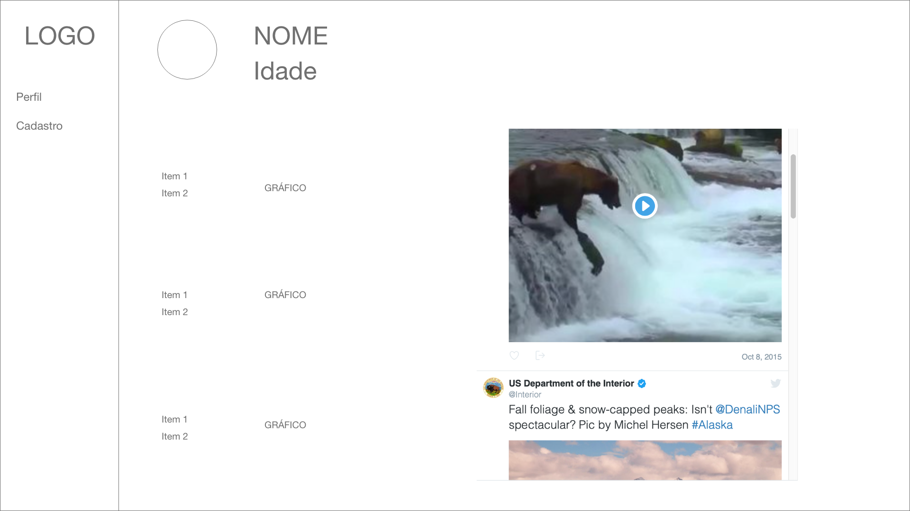
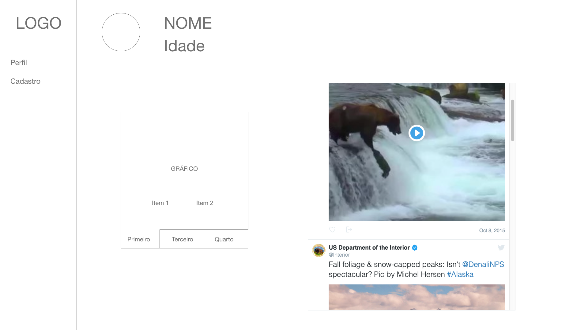

# Appmoove: Teste prático para desenvolvedor front-end

## Pré-requisitos
* HTML5
* CSS3
* JavaScript
* Git

## Desafio
O desafio é realizar o desenvolvimento de um site fictício que realiza o cadastro do perfil de um usuário e exibe suas informações, como: nome, interesses pessoais e o perfil do Twitter. O desenvolvimento deve seguir as instruções apresentadas abaixo.

## Instruções
1. Faça o clone deste repositório.

2. Implemente o desafio.

3. Realize commits locais.

3. Após o término, envie seu projeto <nome_candidato>.zip para o e-mail contato@appmoove.com.br.

### Design
Use sua imaginação e proficiência para construir um design agradável, moderno, responsivo e usual.

## Especificações Técnicas
### Sidebar
Na sidebar haverá o logo e duas seções, uma para cadastro e outra para perfil.

### Seção do cadastro
A seção de cadastro deve conter um formulário com as seguintes informações:

**Campos:**

* Nome;
* Idade;
* Link do perfil do Twitter.

**Foto do perfil**

O usuário poderá selecionar uma foto para o seu perfil dentre as opções a seguir:


**Preferências**

* Cachorro - Gato
* Carro - Moto
* Pizza - Bolo

Esta seleção deve ser feita com uma barra com intervalo.

Exemplo:


### Seção do perfil
Esta seção deve conter as informações referentes ao usuário, como:
* Nome;
* Idade;
* Embedded do link do Twitter;
* Imagem de perfil;
* Gráfico gerado a partir das preferências referentes às opções informadas no cadastro.

Exemplo de perfil 1:



Exemplo de perfil 2:



Essas imagens são meramente ilustrativas, use sua criatividade para desenvolver um layout agradável.

## Critérios de Avaliação

### O que esperamos do seu teste
* Código escrito da maneira mais semântica possível.
* Layout responsivo.
* Utilização adequada do Bootstrap.

### O que ficaríamos felizes em ver em seu teste
* Utilização de conceitos de UX/UI design.

### O que não gostaríamos
* Descobrir que não foi você quem fez seu teste;
* Ver commits grandes, sem ou com descrição sem sentido.

## API
A API permite cadastrar, atualizar e buscar as informações referentes ao perfil do usuário.

### Métodos

* **Criar um usuário**
```
POST http://test-frontend-2019.pareazul.com.br/api/profile?key=SUA_KEY

{
    "name": "Teste",
    "age": 20,
    "twitter_url": "http://twitter.com.br/perfil",
    "dog_percent": 30,
    "cat_percent": 70,
    "car_percent": 30,
    "motorcycle_percent": 70,
    "pizza_percent": 80,
    "cake_percent": 20,
    "photo_name": "avatar3.png"
}
```

* **Alterar um usuário**
```
PUT http://test-frontend-2019.pareazul.com.br/api/profile?key=SUA_KEY

{
    "name": "Teste",
    "age": 20,
    "twitter_url": "http://twitter.com.br/perfil",
    "dog_percent": 30,
    "cat_percent": 70,
    "car_percent": 30,
    "motorcycle_percent": 70,
    "pizza_percent": 80,
    "cake_percent": 20,
    "photo_name": "avatar3.png"
}
```

* **Obter um usuário**
```
GET http://test-frontend-2019.pareazul.com.br/api/profile?key=SUA_KEY

{
    "name": "Teste",
    "age": 20,
    "twitter_url": "http://twitter.com.br/perfil",
    "dog_percent": 30,
    "cat_percent": 70,
    "car_percent": 30,
    "motorcycle_percent": 70,
    "pizza_percent": 80,
    "cake_percent": 20,
    "photo_name": "avatar3.png"
}
```

### Observações
* Os arquivos necessários para o teste estão disponíveis na pasta de assets.
* É permitido o uso de bibliotecas e APIs.
* O design do layout é livre.
* Qualquer dúvida envie um e-mail para contato@appmoove.com.br
* Boa sorte!!!
